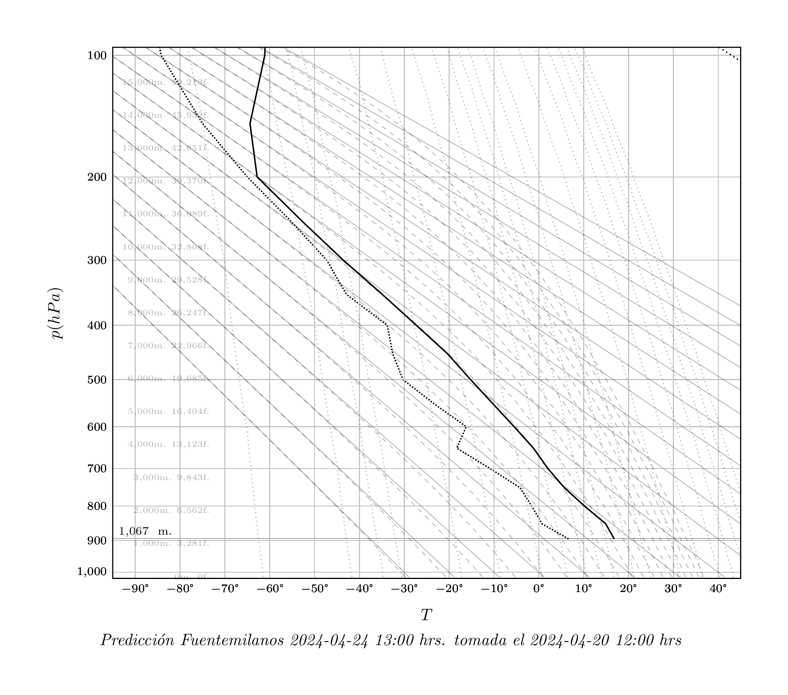

# Stuve diagram

Stuve diagram plot for NOAA soundings.

## Prepare

- Request sounding data from [NOAA](https://www.ready.noaa.gov/READYcmet.php) for specific coordinates (i.e.: 40.874875, -4.227719) with pressure, altitude, temperature, dew point, wind direction and wind speed into ./data/sounding.csv.
- Replace spaces and dots with colon as per example.
- Run `pdflatex ./stuve.tex`.

## Example

